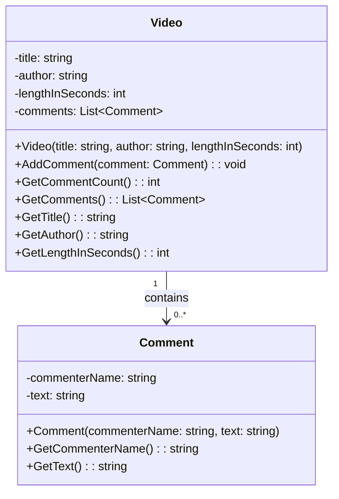
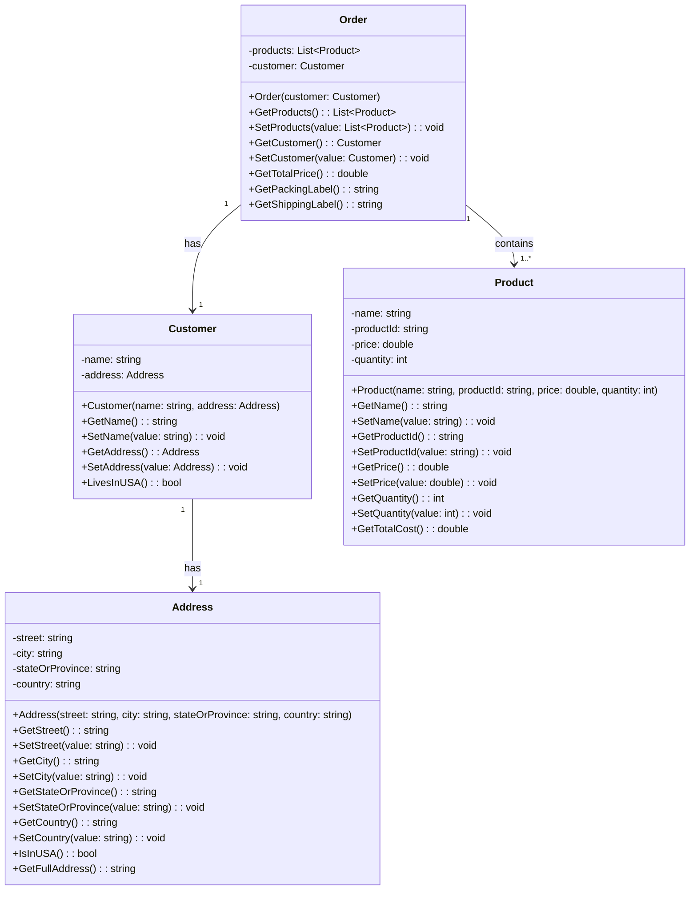

# Foundation Programs Design

## Program 1: YouTube Videos (Abstraction)

This program models a simplified YouTube-style system where Video objects contain a list of Comment objects, demonstrating the abstraction principle by exposing only relevant operations (add/get comments) while hiding internal list management.

### Program flow

1. Program.cs creates 3-4 Video objects, setting title/author/length on each via constructor.
2. For each video, create 3-4 Comment objects (name + text) and add them via `AddComment()`.
3. Put all videos into a `List<Video>`.
4. Loop through the list; for each video print title, author, length, and `GetCommentCount()`, then loop through `GetComments()` and print each comment's name and text.

## Program 2: Online Ordering (Encapsulation)

This program models an order-processing system where Order, Customer, Address, and Product classes encapsulate their data behind private fields, exposing behavior through public methods while hiding internal state.

### Program flow

1. Create at least 2 Address objects (make sure at least one has country "USA" and at least one does not, to exercise both shipping cost branches).
2. Create at least 2 Customer objects, each linked to one of the addresses.
3. Create several Product objects with varying prices and quantities.
4. Create at least 2 Order objects, each containing 2-3 products and one customer.
5. For each order, call and print `GetPackingLabel()`, `GetShippingLabel()`, and `GetTotalPrice()`, and display the results.
